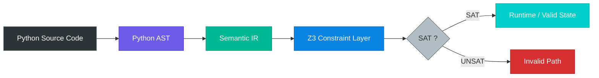

# WARNING THIS IS A WORK IN PROGRESS, README IS AHEAD OF THE ACTUAL CODE FUNCTIONALITIES

# Torch Shape Checker (Z3-powered)


This project implements Microsoft's Z3 SMT solver (https://www.microsoft.com/en-us/research/project/z3-3/).

Ever ran into a simple runtime error hours into model training? If your error was related to linear algebra or oversights regarding Pytorch tensor dimensions, then this tool is for you!

Torch Shape Checker is a static type checker written in Python which checks dimension validity on Pytorch tensors at compile-time instead of runtime. It does this by exploiting Python 3.14 type annotations, everything runs on vanilla Python 3.14. Because this runs on vanilla Python, implementing this tool in your programs is almost effortless, see below!

## Why Z3

Z3 is Microsoft's open source SMT solver. An SMT solver takes in a set constraints and outputs whether they are all feasible or not, which can surprisingly directly be applied to programming languages like Python. With Z3, this tool makes it possible for you to detect dimension mismatches on Pytorch tensors before encountering them hours into model training. 

## Example of a regular Pytorch program

```python
n = 13
m = 3
k = 3

A = torch.tensor([[1, 2, 3]])
B = torch.tensor([[1, 2, 3]])

C = torch.matmul(A, B)
```


## The same program, with annotations

```python
n: int = 1
m: int = 3
k: int = 3

A: torch.Tensor[n, m] = torch.tensor([[1, 2, 3]])  # the tool verifies (n, m) matches actual shape
B: torch.Tensor[m, k] = torch.tensor([[1], [2], [3]]])

C: torch.Tensor[n, k] = torch.matmul(A, B)  # tool verifies A and B can be multiplied and (n, m) matches shape(A dot B)

out -> VALID
```

This tool uses the Z3 SMT solver to collect integer types, and tensor type hints, and enforces the applicable rules for tensor declarations and linear algebra operations at compile-time. This means you do not need to run your code to discover subtle errors, the tool detects your mistakes and reports them to you. Check the following example and output:

```python
n: int = 1
m: int = 3
k: int = 1

A: torch.Tensor[n, m] = torch.tensor([[1, 2, 3, 4]])  # A's type annotation and its actual shape differ
B: torch.Tensor[m, k] = torch.randn(3, 1)

C: torch.Tensor[n, k] = torch.matmul(A, B)

out -> DeclarationError: tensor A was declared with shape(rows=1, cols=4), but expected shape(rows=1, cols=3)
```

# Tool architecture

1. Python source code is converted to an AST using Python's _ast_ module
2. A custom visitor walks the AST and transforms integral dimensions and nodes containing tensors into an IR representing types and shapes
3. A Z3 wrapper completes a pass on the IR and applies constraints based on types and linear algebra rules
4. The program informs the user whether they made any dimension errors or not



# How to use

## Install dependencies

You only need Python 3.14+ and Z3 to run the tool, Pytorch is required only to execute your code

```bash
python3.14 -m pip install z3-solver torch
pip install z3-solver
```
## Run the tool

```bash
torchdimchecker **your_file** --verbose
```

# What is currently supported

```python
torch.matmul
torch.tensor
torch.randn
```

