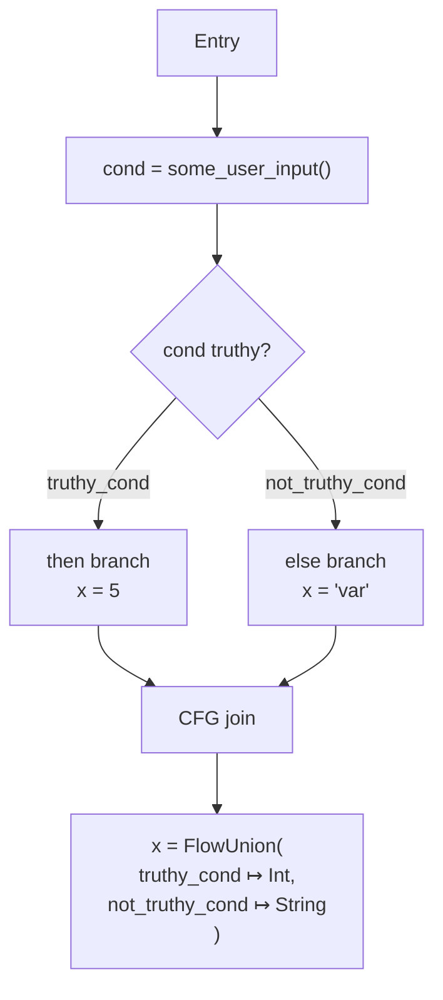
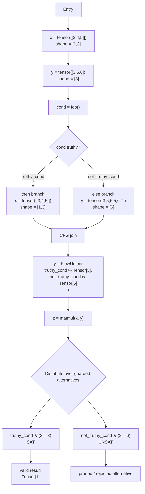
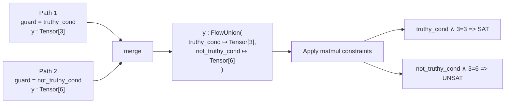
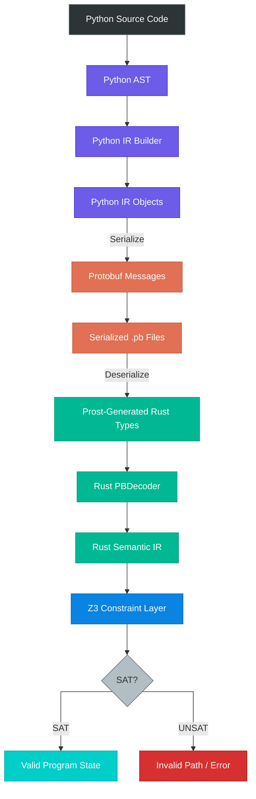

# Torch Shape Checker (Z3-powered)
## WORK IN PROGRESS, IT ONLY SUPPORTS MATMUL FOR NOW


This project implements Microsoft's Z3 SMT solver (https://www.microsoft.com/en-us/research/project/z3-3/).

I don't speak programming languages theory yet, so I had the latest GPT model give me this explanation of the project: "this project explores whether guarded disjunctive abstract values can provide the precision of path-sensitive symbolic reasoning without requiring whole-program path enumeration."

Now, in my own words: this project is a static analyzer which uses Z3 to determine which paths and operations in Python programs will result in a runtime crash, except it tells you this without needing to run your program. This topic isn't new, and has been an active area of research, companies like Meta sponsored projects like PyTea (https://github.com/ropas/pytea), and my project is similar, except I built it with compiler theory in mind, so the end algorithm is different, and **maybe** can prove stronger facts about certain programs involving lots of conditional branching. The authors of PyTea mention they consider every reachable path in their analysis, my tool does not, as it treats constraint collection slightly differently thanks to the fact that I built everything centered around CFGs (Control Flow Graphs). CFGs are strong here, because as we come across constraints, we add them to each graph edge (path, branch) separately, and this allows us to remove edges (prune paths) as we discover UNSAT paths during CFG merges. This is all possible thanks to how I model variables in control flow blocks, take a look at the following example, things will be more clear: 

```python
cond = some_user_input()  # suppose we don't know if "cond" is true, false, let alone bool

if cond:
    x = 5
else:
    x = "var"
```

Then, each of the two branches, if and else, accumulates facts about the type of x, and when merging the two paths, we get the following type:

```rust
Type::FlowUnion([
    GuardedType {
        guard: truthy_cond,
        ty:    Type::Int
    },
    GuardedType {
        guard: not_truthy_cond,
        ty:    Type::String
    },
])
```

which preserves the condition which makes the type hold, and the type of the variable x. Naturally, this stacks, so if you nest branches, we simply formulate that with the logical union, here's an example to illustrate just that:

```python
def foo():
    pass

def bar():
    pass

cond = foo()
other_cond = bar()

if cond:
    if other_cond:
        do_something()
    else:
        do_something_else()
else:
    pass
```

suppose we enter "cond", so "cond" is truthy, we add "cond" to a set of constraints **local to the graph edge**. Then, if "other_cond" is truthy, we just do: constraints.add(&z3::and(&cond, other_cond)). Simple, but here's when this becomes strong with my CFG: 

## Example 1: CFG join with guarded types


```mermaid
flowchart TD
    A[Entry] --> B["cond = some_user_input()"]
    B --> C{"cond truthy?"}

    C -->|truthy_cond| D["then branch<br/>x = 5"]
    C -->|not_truthy_cond| E["else branch<br/>x = 'var'"]

    D --> F["CFG join"]
    E --> F

    F --> G["x = FlowUnion(<br/>truthy_cond ↦ Int,<br/>not_truthy_cond ↦ String<br/>)"]
```

## Example 2: Path-sensitive tensor reasoning with Z3


```mermaid
flowchart TD
    A[Entry] --> B["x = tensor([[3,4,5]])<br/>shape = [1,3]"]
    B --> C["y = tensor([3,5,6])<br/>shape = [3]"]
    C --> D["cond = foo()"]
    D --> E{"cond truthy?"}

    E -->|truthy_cond| F["then branch<br/>x = tensor([[3,4,5]])<br/>shape = [1,3]"]
    E -->|not_truthy_cond| G["else branch<br/>y = tensor([3,5,6,5,6,7])<br/>shape = [6]"]

    F --> H["CFG join"]
    G --> H

    H --> I["y = FlowUnion(<br/>truthy_cond ↦ Tensor[3],<br/>not_truthy_cond ↦ Tensor[6]<br/>)"]

    I --> J["z = matmul(x, y)"]
    J --> K{"Distribute over guarded alternatives"}

    K --> L["truthy_cond ∧ (3 = 3)<br/>SAT"]
    K --> M["not_truthy_cond ∧ (3 = 6)<br/>UNSAT"]

    L --> N["valid result:<br/>Tensor[1]"]
    M --> O["pruned / rejected alternative"]
```

## Example 3: Guarded union after merge


```mermaid
flowchart LR
    A["Path 1<br/>guard = truthy_cond<br/>y : Tensor[3]"] --> C["merge"]
    B["Path 2<br/>guard = not_truthy_cond<br/>y : Tensor[6]"] --> C
    C --> D["y : FlowUnion(<br/>truthy_cond ↦ Tensor[3],<br/>not_truthy_cond ↦ Tensor[6]<br/>)"]
    D --> E["Apply matmul constraints"]
    E --> F["truthy_cond ∧ 3=3  => SAT"]
    E --> G["not_truthy_cond ∧ 3=6 => UNSAT"]
```

Those are a couple of the examples which are working as of writing this README. Exciting I think, and there's still more to come, like merging affine sets while keeping more information about those sets. A topic for later, for now development will focus on expanding on this interesting CFG-path-pruning algorithm. 

Also if you want to contribute feel free to do so, contributions are welcome, my codebase is a bit of a mess and can use some refactoring. Below is some details on the architecture of the tool. 

## Architecture


```mermaid
%%{init: {"flowchart": {"curve": "stepAfter", "nodeSpacing": 40, "rankSpacing": 55}}}%%
flowchart TB
    A["Python Source Code"]
    B["Python AST"]
    C["Python IR Builder"]
    D["Python IR Objects"]

    E["Protobuf Messages"]
    F["Serialized .pb Files"]

    G["Prost-Generated Rust Types"]
    H["Rust PBDecoder"]
    I["Rust Semantic IR"]

    J["Z3 Constraint Layer"]
    K{"SAT?"}
    L["Valid Program State"]
    M["Invalid Path / Error"]

    A --> B
    B --> C
    C --> D
    D -->|"Serialize"| E
    E --> F
    F -->|"Deserialize"| G
    G --> H
    H --> I
    I --> J
    J --> K
    K -->|SAT| L
    K -->|UNSAT| M

    classDef source fill:#2d3436,color:#fff,stroke:#636e72
    classDef python fill:#6c5ce7,color:#fff,stroke:#4834d4
    classDef proto fill:#e17055,color:#fff,stroke:#c05640
    classDef rust fill:#00b894,color:#fff,stroke:#019875
    classDef solver fill:#0984e3,color:#fff,stroke:#0767b1
    classDef decision fill:#b2bec3,color:#2d3436,stroke:#636e72
    classDef valid fill:#00cec9,color:#fff,stroke:#00a8a8
    classDef invalid fill:#d63031,color:#fff,stroke:#a61e1e

    class A source
    class B,C,D python
    class E,F proto
    class G,H,I rust
    class J solver
    class K decision
    class L valid
    class M invalid
```

# How to use

No binaries right now, will publish a release if development gets to a point where it makes sense to do so, right now it's still a demo. 
